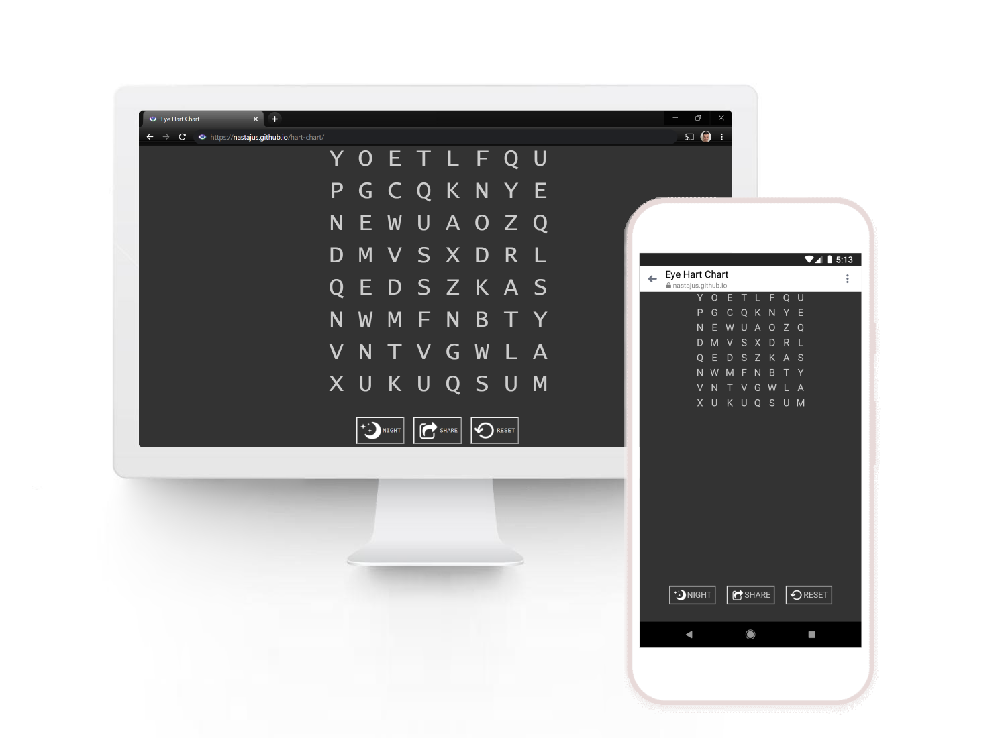

A "[Hart chart](http://semovisioncare.com/Pt%20Forms/Pt%20education/Hart%20Chart.pdf)" for practicing eye scanning exercises.

Clone or download project, open index.html in your browser, each reset randomly creates new character set. No repeating letters (keep mind from getting bored from repetitive exercise), no thin letters (I and J removed). 

Tested primarily in Windows Chrome, but also in Firefox, Opera, Edge, Android, and Safari.

Live version [here](https://nastajus.github.io/hart-chart/).

