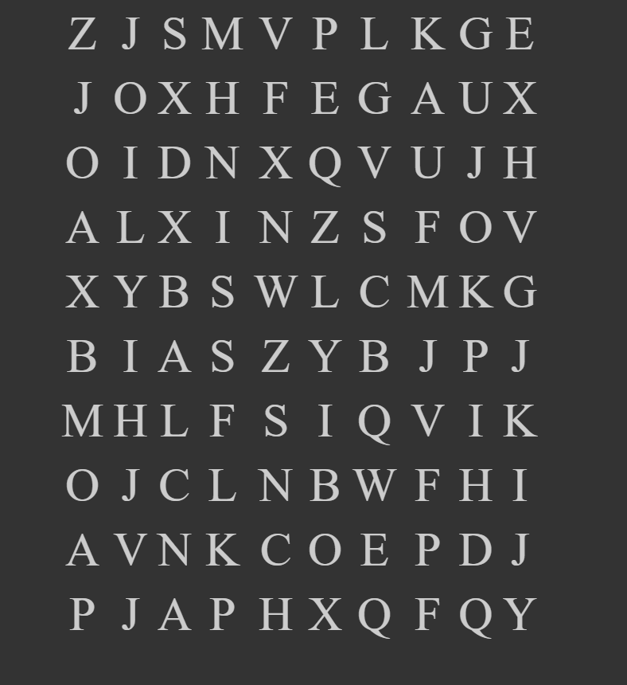

A "doctor heart chart" for practicing eye scanning exercises.

Clone or download project, open index.html in your browser, each reload randomly creates new character set. No repeating letters. Tested in Chrome.

